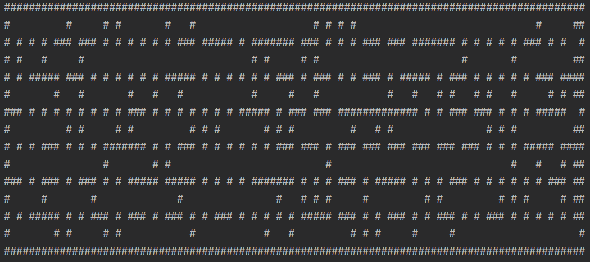

# maze_solver
A group project of testing different algorithms of finding path in a generated maze. 

Project is built using Intellij IDEA 2020

## Project structure

- [data](https://github.com/4math/maze_solver/tree/main/data) folder contains excel files with the test results of the algorithms.
- [slides](https://github.com/4math/maze_solver/tree/main/slides) folder contains presentation slides(in Latvian).
- [images](./images) folder contains images for slides and README. 
- [maze_solver/src/dip107](https://github.com/4math/maze_solver/tree/main/maze_solver/src/dip107) folder contains source files:
  - [Labyrinth.java](https://github.com/4math/maze_solver/blob/main/maze_solver/src/dip107/Labyrinth.java) - a class which holds the maze structure. This class allows to generate mazes with Prim's or RDFS algorithm. It also allows to use different pathfinding algorithms - DFS, BFS, A* - on a generated or manually created maze.
  - [Main.java](https://github.com/4math/maze_solver/blob/main/maze_solver/src/dip107/Main.java) - a start of the program. Inputs the maze and pathfinding parameters.
  - [MazeTestFramework.java](https://github.com/4math/maze_solver/blob/main/maze_solver/src/dip107/MazeTestFramework.java) - a class used for testing the performance of maze generation algorithms. Outputs results into console with specific formatting for an Excel document.
  - [PathfindingTestFramework.java](https://github.com/4math/maze_solver/blob/main/maze_solver/src/dip107/PathfindingTestFramework.java) - a class used for testing the performance of pathfinding generation algorithms. Outputs results into console with specific formatting for an Excel document.
  - [Pair.java](https://github.com/4math/maze_solver/blob/main/maze_solver/src/dip107/Pair.java) - a class which holds a pair of coordinates of the maze.
  - [Tuple.java](https://github.com/4math/maze_solver/blob/main/maze_solver/src/dip107/Tuple.java) - a class used for storing a pair and f value for A* algorithm.
  - [TupleComparator.java](https://github.com/4math/maze_solver/blob/main/maze_solver/src/dip107/TupleComparator.java) - a class which implements Comparator and sorts f values in descending order for the PriorityQueue in A* algorithm.

## Program arguments

| Argument    | Description                                                  |
| ----------- | ------------------------------------------------------------ |
| **-tprim**  | It tests Prim's algorithm 5 times for different maze sizes and fixes the execution time. Outputs a result as a table for Excel document. |
| **-trdfs**  | It tests RDFS algorithm 5 times for different maze sizes and fixes the execution time. Outputs a result as a table for Excel document. |
| **-tdfs**   | It tests DFS algorithm 5 times for different maze sizes in RDFS generated mazes and then 5 times in Prim's mazes. It fixes the execution time and a found path length. Outputs a result as a table for Excel document. |
| **-tbfs**   | It tests BFS algorithm 5 times for different maze sizes in RDFS generated mazes and then 5 times in Prim's mazes. It fixes the execution time and a found path length. Outputs a result as a table for Excel document. |
| **-tastar** | It tests A* algorithm 5 times for different maze sizes in RDFS generated mazes and then 5 times in Prim's mazes. It fixes the execution time and a found path length. Outputs a result as a table for Excel document. |
| **-ft**     | It executes a full test, meaning, that all above tests will be executed. |
| **-pretty** | Turns on maze printing into the console. Be careful with big mazes. See example of a printed maze below. |

## Printing mazes

Using a **-pretty** flag while starting a program, it is possible to see a generated maze and then find a path to the exit:

A maze generated by a Prim's algorithm(13 rows by 92 columns) and the found path(red stars) by A* algorithm.  

## Algorithms 

Algorithms which were used.

| Algorithm        | Contributor | Description               |
| ---------------- | ----------- | ------------------------- |
| Prim's algorithm | Ri0ee       | Maze generation algorithm |
| RDFS             | cyoq        | Maze generation algorithm |
| DFS              | Ri0ee       | Pathfinding algorithm     |
| BFS              | Ri0ee       | Pathfinding algorithm     |
| A*               | cyoq        | Pathfinding algorithm     |

